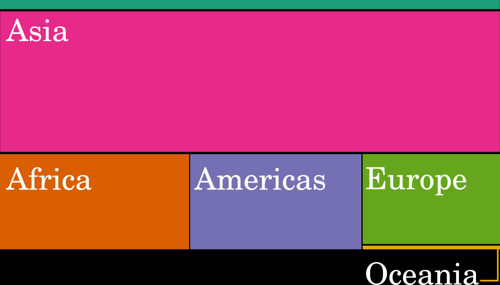
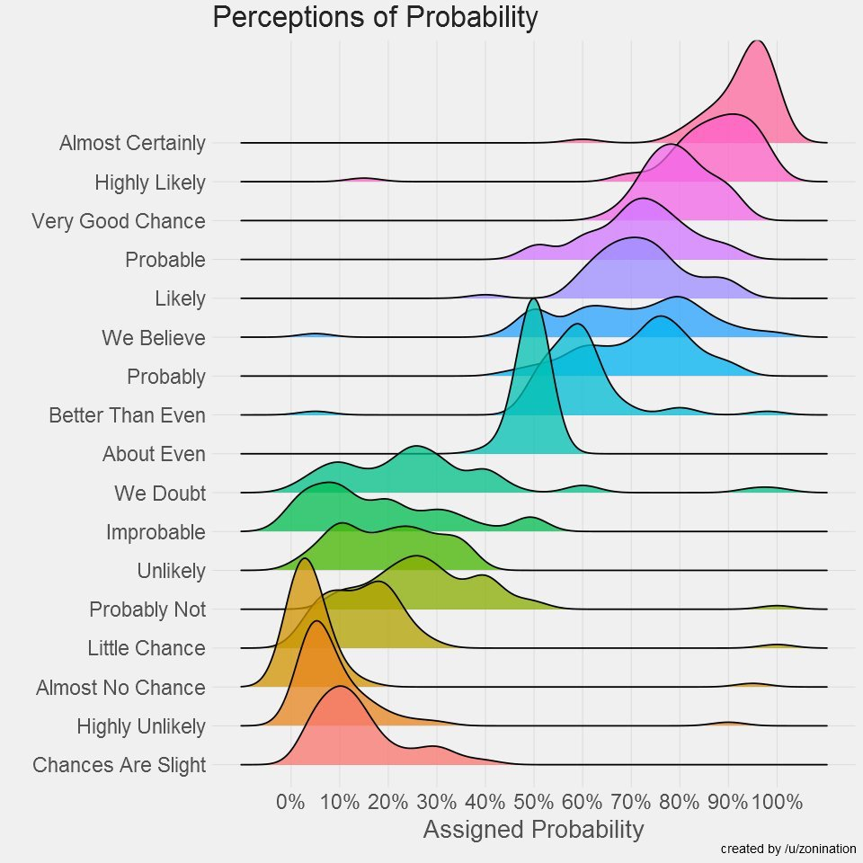
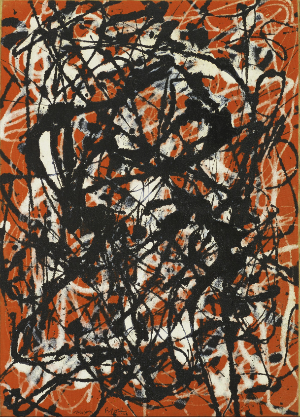

```{r setup, echo=FALSE, message=FALSE, warning=FALSE}
knitr::opts_chunk$set(echo=FALSE, comment=NA, fig.align = "center")
library(tidyverse)
library(knitr)
library(VennDiagram)
library(RColorBrewer)
library(ggforce)
library(quantmod)
library(sf)


theme_mati <- theme_gray(base_size = 16, base_family = "")

```


## Today's discussion

1. Dos and Don'ts 
1. Know your Data 
1. DataViz Election 


## Dos and Dont's

## Font Size

```{r font-size, fig.align="center"}

claim <- "Can you read me now?"

claim_frame <- tibble(
  claim = claim,
  font_size = rev(seq(2, 28, 2)),
  x = 1,
  y = 1:length(font_size)
)

ggplot(claim_frame, aes(x, y))+
  geom_text(aes(label=paste(claim, "--->", font_size), size=font_size), color="white") +
  theme_void() + theme(legend.position = "none", panel.background = element_rect(fill="black", color=NA))


```


## Color

## 

> What do you use color for?

## 

```{r, results="hold", fig.align="center"}
pal <- brewer.pal(7, "Set1")
deutan <- dichromat::dichromat(pal, "deutan")
protan <- dichromat::dichromat(pal, "protan")
tritan <- dichromat::dichromat(pal, "tritan")

world_sf <- sf::st_as_sf(rworldmap::getMap(resolution = "low")) %>%
  # remove antartica
  filter(SOV_A3 != "ATA")

crs_mercator <- "+proj=merc"

mercator_bbox <- 
  rbind(c(-180, -65), c(180, 85)) %>%
  st_multipoint() %>%
  st_sfc(
    crs = "+proj=longlat +ellps=WGS84 +datum=WGS84 +no_defs"
  ) %>% 
  st_transform(crs = crs_mercator)

ggplot(world_sf) + 
  geom_sf(fill = "#E69F00B0", color = "black", size = 0.5/.pt) + 
  scale_x_continuous(name = NULL, breaks = seq(-120, 120, by = 60)) +
  scale_y_continuous(name = NULL, breaks = seq(-60, 60, by = 30)) +
  coord_sf(
    xlim = mercator_bbox[[1]][, 1],
    ylim = mercator_bbox[[1]][, 2],
    expand = FALSE,
    crs = crs_mercator
  ) + 
  ggtitle("The World", subtitle = "According to Mercator projection") +
  theme_minimal() +
  theme(panel.background = element_rect(fill = "#56B4E950",
                                        color = "white", size = 1),
    panel.grid.major = element_line(color = "gray30", size = 0.25)
  )


```

## 

```{r, fig.align="center"}
map_by_region <- ggplot(world_sf) + 
  geom_sf(aes(fill=REGION), color = "black", size = 0.5/.pt) + 
  scale_x_continuous(name = NULL, breaks = seq(-120, 120, by = 60)) +
  scale_y_continuous(name = NULL, breaks = seq(-60, 60, by = 30)) +
  coord_sf(
    xlim = mercator_bbox[[1]][, 1],
    ylim = mercator_bbox[[1]][, 2],
    expand = FALSE,
    crs = crs_mercator
  ) + 
  ggtitle("The World", subtitle = "According to Mercator projection") +
  theme_minimal() +
  theme(panel.background = element_rect(fill = "#56B4E950",
                                        color = "white", size = 1),
    panel.grid.major = element_line(color = "gray30", size = 0.25)
  ) 

print(map_by_region)
```

##

```{r, fig.align="center"}
pB <- map_by_region + scale_fill_manual(values=deutan) +
  theme(legend.position = "none") +
  ggtitle("Deutan Color Blindness", "")
pC <- map_by_region +
  scale_fill_manual(values=protan)+
  theme(legend.position = "none")+
  ggtitle("Protan Color Blindness", "")
pD <- map_by_region +
  scale_fill_manual(values=tritan)+
  theme(legend.position = "none")+
  ggtitle("Tritan Color Blindness", "")

cowplot::plot_grid(map_by_region + theme(legend.position="none"),
                   pB, pC, pD, nrow=2, labels="AUTO")

```

##

```{r, out.width="150%"}
include_graphics("http://jfly.iam.u-tokyo.ac.jp/color/image/pallete.jpg"
                 )
```

###### Source: http://jfly.iam.u-tokyo.ac.jp/color/image/pallete.jpg

## RColorBrewer

```{r, echo=TRUE, out.width="75%", fig.align="center"}
display.brewer.all(colorblindFriendly = TRUE)
```


## Y axis manipulation

## 

```{r, warning=FALSE, message=FALSE}
manip <- tibble(opinion=c("yes", "no"), 
                value =c(95, 5))

wrong_y <- ggplot(manip, aes(factor(1), value, fill=opinion)) +
  geom_col(width = 0.8)+
  ylab("Opinion (%)")+
  xlab("Mystery group")+
  ggtitle("Is it wrong to manipulate the y axis?")+
  theme_mati+
  theme_bw()+
  theme(legend.position = "bottom")+
  scale_fill_manual(values=c("darkorange", "steelblue"))+
  theme(axis.text.x = element_blank(),
        axis.ticks.x = element_line())+
  NULL

p1 <- wrong_y +
  scale_y_continuous(expand = c(0,0))+
  coord_cartesian(ylim=c(90,100))

print(p1)

```

## 

```{r, warning=FALSE, message=FALSE}

cowplot::plot_grid(
  p1,
  wrong_y + 
    scale_y_continuous(expand=c(0,0),
                      limits=c(0,100)), 
                   ncol=2, align = "h", labels = NA)

```

## 
> When can we justify changing the y axis?

## 

```{r}
alice <- tibble(
  time = format(seq.POSIXt(as.POSIXct(Sys.Date()),
                           as.POSIXct(Sys.Date()+1),
                           by = "60 min"),
                           "%H:%M", tz="GMT"),
  temperature = 98 + rnorm(25, 0, 0.5),
  person = c("Alice"),
  recording_hour = 1:25) 

bob <- tibble(
  time = format(seq.POSIXt(as.POSIXct(Sys.Date()),
                           as.POSIXct(Sys.Date()+1),
                           by = "60 min"),
                          "%H:%M", tz="GMT"),
  temperature = 98 + rnorm(25, 2, 1),
  person = c("Bob"),
  recording_hour = 1:25) 

df <- bind_rows(alice, bob)

two_colors <- c("black", "#36D5FF")

temp_plot <- ggplot(df, aes(recording_hour, temperature, color=person))+
  geom_line(lwd=1)+
  geom_point(size=3, color="white")+
  geom_point(size=2)+
  theme_mati+
  theme_bw()+
  scale_x_continuous(breaks=seq(1, 25, 2), labels = format(seq.POSIXt(as.POSIXct(Sys.Date()),
                           as.POSIXct(Sys.Date()+1),
                           by = "120 min"),
                          "%H:%M", tz="GMT"))+
  xlab("")+ ylab("Temperature (F)")+
  theme(legend.position = "none")+
  annotate("text", x=c(1,1),
           y = c(96, 103),
           label=c("Alice", "Bob"), color=two_colors)+
  scale_color_manual(values=two_colors)


```


```{r}
temp_plot + ylim(c(0, 105))
```

##

```{r}
temp_plot
```

## Don't tell, show

## Don't tell, show

###### Once upon a time, there was a little girl who lived in a village near the forest.  Whenever she went out, the little girl wore a red riding cloak, so everyone in the village called her Little Red Riding Hood. One morning, Little Red Riding Hood asked her mother if she could go to visit her grandmother as it had been awhile since they'd seen each other. "That's a good idea," her mother said.  So they packed a nice basket for Little Red Riding Hood to take to her grandmother. When the basket was ready, the little girl put on her red cloak and kissed her mother goodbye. "Remember, go straight to Grandma's house," her mother cautioned.  "Don't dawdle along the way and please don't talk to strangers!  The woods are dangerous." "Don't worry, mommy," said Little Red Riding Hood, "I'll be careful." But when Little Red Riding Hood noticed some lovely flowers in the woods, she forgot her promise to her mother.  She picked a few, watched the butterflies flit about for awhile, listened to the frogs croaking and then picked a few more. 

## Don't tell, show

```{r, fig.align="center", out.width="30%"}
include_graphics("https://upload.wikimedia.org/wikipedia/commons/thumb/1/18/Little_Red_Riding_Hood_WPA_poster.jpg/800px-Little_Red_Riding_Hood_WPA_poster.jpg")
```


## Going 3D

## 

```{r, message=FALSE, warning=FALSE}

data <- read.csv("https://raw.githubusercontent.com/plotly/datasets/master/gapminderDataFiveYear.csv")

data_2007 <- data[which(data$year == 2007),]
data_2007 <- data_2007[order(data_2007$continent, data_2007$country),]
data_2007$size <- data_2007$pop
colors <- c('#4AC6B7', '#1972A4', '#965F8A', '#FF7070', '#C61951')


p <- plotly::plot_ly(data_2007,
                     x = ~gdpPercap,
                     y = ~lifeExp,
                     z = ~pop,
                     color = ~continent,
                     colors = colors,
             marker = list(symbol = 'circle',
                           sizemode = 'diameter', size=3),
             sizes = c(5),
             text = ~paste('Country:', country, '<br>Life Expectancy:', lifeExp, '<br>GDP:', gdpPercap,
                           '<br>Pop.:', pop)) %>%
  plotly::layout(
         scene = list(xaxis = list(title = 'GDP per capita',
                      gridcolor = 'rgb(255, 255, 255)',
                      range = c(2.003297660701705, 5.191505530708712),
                      type = 'log',
                      zerolinewidth = 1,
                      ticklen = 5,
                      gridwidth = 2),
               yaxis = list(title = 'Life Expectancy (years)',
                      gridcolor = 'rgb(255, 255, 255)',
                      range = c(36.12621671352166, 91.72921793264332),
                      zerolinewidth = 1,
                      ticklen = 5,
                      gridwith = 2),
               zaxis = list(title = 'Population',
                            gridcolor = 'rgb(255, 255, 255)',
                            type = 'log',
                            zerolinewidth = 1,
                            ticklen = 5,
                            gridwith = 2)),
         paper_bgcolor = 'rgb(243, 243, 243)',
         plot_bgcolor = 'rgb(243, 243, 243)')


p

```


## 

```{r, warning=FALSE}

panel1 <- ggplot(data_2007, aes(gdpPercap, pop, color=continent))+
  theme_mati+
  geom_point()+
  scale_color_manual(values=colors) +
  scale_x_log10(breaks=c(300, 1000, 3000, 10000, 30000),
                labels=c("0.3K", "1K", "3K", "10K", "30K")) +
  scale_y_log10(breaks=c(10^6, 10^7, 10^8, 10^9),
                labels=c("1M", "10M", "100M", "1B"))+
  ylab("Population")+ xlab("GDP per capita \n(US dollars)")+
  theme(legend.position="none")
  
panel2 <- ggplot(data_2007, aes(gdpPercap, lifeExp, color=continent))+
  theme_mati+
  geom_point()+
  scale_color_manual(values=colors) +
  scale_x_log10(breaks=c(300, 1000, 3000, 10000, 30000),
                labels=c("0.3K", "1K", "3K", "10K", "30K")) +
#  scale_y_log10(breaks=c(10^6, 10^7, 10^8, 10^9),
#                labels=c("1M", "10M", "100M", "1B"))+
  ylab("Life Expectancy (years)")+ xlab("GDP per capita \n(US dollars)")+
  theme(legend.position="bottom")+
  NULL


first_row <- cowplot::plot_grid(panel1, panel2 + theme(legend.position="none"), labels=NA, align = "h", ncol=2)

cowplot::plot_grid(first_row, cowplot::get_legend(panel2), rel_heights = c(1,0.2), align="c", nrow=2)


```


## 

```{r, out.width="60%"}
include_graphics("https://serialmentor.com/dataviz/no_3d_files/figure-html/rotated-pie-1.png")
```

<center>
###### source: serialmentor.com/dataviz
<center>

## 

<center>
#### You should go 3D when it's physically meaningful 
<center>

```{r}
library(plot3D)
par(mar=c(0,0,0,0))
persp3D(z = volcano, col = "lightblue", shade = 0.5,
 ticktype = "detailed", bty = "b2")

```


## War on Pies

##

<center>
#### Pies are great
<center>

```{r}
df <- data.frame(
  group = c("Almost Nothing", "A lot"),
  value = c(3, 97)
  )

ggplot(df)+
  ggforce::geom_arc_bar(aes(
  x0 = 0, y0 = 0, r0 = 0, r = 1, amount = value,
  fill = group), stat="pie") +
  theme_void()+
  theme(legend.position = "bottom")+
  guides(guide_legend(color=""))+
  scale_fill_manual(values=c("gray50", "pink"))

```

##
<center>
#### Pies are great
<center>

```{r}
df <- data.frame(
  group = c("One quarter", "Three quarters"),
  value = c(25, 75)
  )

ggplot(df)+
  ggforce::geom_arc_bar(aes(
  x0 = 0, y0 = 0, r0 = 0, r = 1, amount = value,
  fill = group), stat="pie") +
  theme_void()+
  theme(legend.position = "bottom")+
  guides(guide_legend(color=""))+
  scale_fill_manual(values=c("pink", "gray50"))

```

## Time to draw

##

```{r}
# Load dataset from github
data <- read.table("https://raw.githubusercontent.com/holtzy/data_to_viz/master/Example_dataset/11_SevCatOneNumNestedOneObsPerGroup.csv", header=T, sep=";")
data[ which(data$value==-1),"value"] <- 1
colnames(data) <- c("Continent", "Region", "Country", "Pop")


data %>%
  group_by(Continent)%>%
  summarise(pop = sum(Pop))%>%
  filter(Continent!="")%>%
#  janitor::adorn_totals("row", name="General") %>%
#  mutate(Continent = fct_reorder(Continent, desc(pop))) %>%
#  filter(Continent != "General") %>%
  ggplot()+
    ggforce::geom_arc_bar(aes(
  x0 = 0, y0 = 0, r0 = 0, r = 1, amount = pop,
  fill = Continent), stat="pie") +
  theme_void()+
  theme(legend.position = "bottom")+
  scale_fill_manual(values = brewer.pal(6, "Dark2")[2:6])+
  ggtitle("World Population by Continent")


```


## Treemap

```{r}

```


```{r, echo=FALSE, message=FALSE, warning=FALSE, eval=FALSE}
library(treemap)
library(d3treeR)


# Plot
p <- treemap(data,
             # create but not draw
             draw= FALSE,
            # data
            index=c("Continent", "Region", "Country"),
            vSize="Pop",
            type="index",
            
            # Main
            title="",
            palette="Dark2",

            # Borders:
            border.col=c("black", "grey", "grey"),             
            border.lwds=c(1,0.5,0.1),                         
        
            # Labels
            fontsize.labels=c(0.7, 0.4, 0.3),
            fontcolor.labels=c("white", "white", "black"),
            fontface.labels=1,            
            bg.labels=c("transparent"),              
            align.labels=list( c("center", "center"), c("left", "top"), c("right", "bottom")),                                  
            overlap.labels=0.5#, inflate.labels=T   
            
)


d3tree2( p ,  rootname = "General" )

```


## Know your Audience

## 
<center>
###### Who are you talking to?
<center>

```{r make-venn}


df_circle <- data.frame(class=c("Specialist", "Public", "Stakeholder"),
                   x=c(1,1.5,2),
                   y=c(1,2,1),
                   r=1,
                   text_x = c(0, 1.5, 3),
                   text_y = c(0, 3.2, 0))

#ggplot(df) +
#  geom_text(aes(x=text_x, y=text_y, label=class))+
#  theme_void()+
#  theme(legend.position = "none")

#x=c(1,1.5,2),
#y=c(1,2,1),
set.seed(123)

y0 <- rnorm(1000, mean = 1, sd = .3)
y1 <- rnorm(1000, mean = 2, sd = .3) 

x0 <- rnorm(1000, mean = 1, sd=.3)  
x1 <- rnorm(1000, mean=1.5, sd=.3)
x2 <- rnorm(1000, mean=2, sd=.3)

df1 <- data.frame(class= "Specialist", x = x0, y=y0, stringsAsFactors = F)
df2 <- data.frame(class= "General Public", x=x1, y=y1, stringsAsFactors = F)
df3 <- data.frame(class="Stakeholder", x=x2, y=y0, stringsAsFactors = F)

df <- bind_rows(df1,df2,df3)  


venn_colors <- c("#00AFBB", "#E7B800", "#FC4E07")

ggplot(df, aes(x,y, color=class))+
  geom_circle(data=df_circle,
              aes(x0=x,y0=y, r=r, fill=class),
              alpha=0.2, inherit.aes = FALSE, color=NA)+
  geom_point(alpha=0.8)+
  geom_text(data=df_circle, aes(x=text_x, y=text_y, label=class), color="white", size=9)+
  xlim(c(-0.5,3.5))+ ylim(c(-0.5,3.5))+
  scale_color_manual(values = venn_colors)+
  scale_fill_manual(values = venn_colors)+
  theme_void()+
  theme(legend.position = "none",
        panel.background = element_rect(fill="gray10"))
    
```

##

```{r, message=FALSE, warning=FALSE}
AMZN <- getSymbols("AMZN", auto.assign=FALSE)
chartSeries(AMZN)
```

##

`r paste0("Amazon's Last Price: ", round(AMZN$AMZN.Close[nrow(AMZN)], 2))`

## 

```{r}
AAPL <- getSymbols("AAPL", auto.assign=FALSE)
GOOGL <- getSymbols("GOOGL", auto.assign=FALSE)

AMZN_min = as.data.frame(AMZN$AMZN.Open[1])%>%
  tibble::rownames_to_column()
names(AMZN_min) <- c('date', "price")
AMZN_max = as.data.frame(AMZN$AMZN.Close[nrow(AMZN)])%>% tibble::rownames_to_column()
names(AMZN_max) <- c("date", "price")

# AAPL
AAPL_min = as.data.frame(AAPL$AAPL.Open[1])%>%
  tibble::rownames_to_column()
names(AAPL_min) <- c('date', "price")
AAPL_max = as.data.frame(AAPL$AAPL.Close[nrow(AAPL)])%>% tibble::rownames_to_column()
names(AAPL_max) <- c("date", "price")

# GOOGL
GOOGL_min = as.data.frame(GOOGL$GOOGL.Open[1])%>%
  tibble::rownames_to_column()
names(GOOGL_min) <- c('date', "price")
GOOGL_max = as.data.frame(GOOGL$GOOGL.Close[nrow(GOOGL)])%>% tibble::rownames_to_column()
names(GOOGL_max) <- c("date", "price")

bind_rows(AMZN_min , AMZN_max, AAPL_min, AAPL_max, GOOGL_min, GOOGL_max) %>%
  mutate(ticker = c("AMZN","AMZN", "AAPL","AAPL", "GOOGL","GOOGL")) %>%
  group_by(ticker) %>%
  mutate(days = diff(lubridate::ymd(date)),
         diff_price = diff(price),
         roi = diff_price/min(price)) %>% 
  summarise(roi=unique(roi)) %>%
  ggplot(aes(fct_reorder(ticker, roi), roi))+
  geom_col(fill ="steelblue")+
  theme_mati+
  theme_bw()+
  coord_flip()+
  ylab("Return of investment (times)") + xlab("") +
  labs('Return of investment',
       paste0("From ", GOOGL_min$date, " to present."))

```

 

```{r, out.width="75%", include=FALSE}
## Watch your words

##

```


## The Power of Context

## 17550020191010
## 17:55:00 2019-10-10

## 17:55:00 2019-10-10

```{r, echo=FALSE, out.width="50%", fig.align='center'}
knitr::include_graphics(c("img/clock_1755.png", "img/calendar.png"))
```

## 17:55:00 2019-10-10

```{r, echo=FALSE, out.width="50%", fig.align='center'}
knitr::include_graphics(c("img/clock_0555.png","img/UScalendar.PNG"))
```

## Know Your Data

## Data-types

Data come in all flavours

* Numeric (Age, $, height, Life-Exp)
* Categorical (Young/Old, Republican/Democrat)
* Network (Environment, People Interaction)
* Spatial (Maps, Geographical)

## Numeric data

## One variable -- Distribution

##

```{r, prepare-one-variable-plots}
p1 <- ggplot(data_2007, aes(x=1, y=lifeExp))+
  theme_mati+
  theme(panel.background = element_rect(fill="#f6e6bfff"),
        panel.grid = element_line(color=NA),
        axis.text = element_text(color="#493E16"),
        axis.text.x = element_text(color = NA),
        axis.ticks.x = element_line(color=NA),
        axis.line.y = element_line(color="#493E16",
                                   lineend = "butt", size = 1))+
  xlab("")+ ylab("Life Expectancy")+ xlim(c(0, 2))

box_plot <- p1 + geom_boxplot(fill="#ffe300ff", color ="#493E16", fatten=2.5, width=1)+
  labs(title = "Boxplot")
violin <- p1 + geom_violin(fill="#ffe300ff", color="#493E16")+
  labs(title = "Violin")
set.seed(123)
jitter <- p1 + geom_jitter(color="#493E16")+
  labs(title = "Jitter")
quasirandom <- p1 +
  ggbeeswarm::geom_quasirandom(color="#493E16")+
  labs(title = "Density-Jitter")

```

```{r}
cowplot::plot_grid(box_plot,
                   p1 + labs(title=""),
                   p1 + labs(title=""),
                   p1 + labs(title=""),
                   labels="AUTO")

```


##

```{r}
cowplot::plot_grid(box_plot,
                   violin,
                   p1 + labs(title=""),
                   p1 + labs(title=""),
                   labels="AUTO")
```


##

```{r}
cowplot::plot_grid(box_plot,
                   violin,
                   jitter,
                   p1 + labs(title=""),
                   labels="AUTO")
```


##

```{r}
cowplot::plot_grid(box_plot,
                   violin,
                   jitter,
                   quasirandom,
                   labels="AUTO")
```

## Two variables -- relationship

## 

```{r}
p2 <- ggplot(data_2007, aes(x=log10(gdpPercap), y=lifeExp))+
  theme_mati+
  theme(panel.background = element_rect(fill="#f6e6bfff"),
        panel.grid = element_line(color=NA),
        axis.text = element_text(color="#493E16"),
#        axis.text.x = element_text(color = NA),
        axis.line.x = element_line(color="#493E16",
                                   lineend = "butt", size = 1),
        axis.line.y = element_line(color="#493E16",
                                   lineend = "butt", size = 1))+
  xlab("GDP per Capita")+ ylab("Life Expectancy")


scatt <- p2 + geom_point() + labs(title = "Scatterplot")
density_2d <- p2 + stat_density2d(color="#493E16")+labs(title = "Density 2D")
hex_plot <- p2 + geom_hex(bins=10, color="#493E16") +
  labs(title = "Hex plot")+
  scale_fill_gradient(low="#f6e6bfff", high = "#493E16")+
  theme(legend.position = "none")+
    theme(panel.background = element_rect(fill="#f6e6bfff"),
        panel.grid = element_line(color=NA),
        axis.text = element_text(color="#493E16"),
#        axis.text.x = element_text(color = NA),
        axis.line.x = element_line(color="#493E16",
                                   lineend = "butt", size = 1),
        axis.line.y = element_line(color="#493E16",
                                   lineend = "butt", size = 1))
  
regress <- p2 + geom_smooth(color="black", method="loess") + geom_point(alpha=0.5) + labs(title = "Scatter + Regression")
```


```{r}
cowplot::plot_grid(scatt,
                   p2 + labs(title = ""),
                   p2 + labs(title = ""),
                   p2 + labs(title = ""), labels="AUTO")

```


##

```{r}
cowplot::plot_grid(scatt,
                   regress,
                   p2 + labs(title=""),
                   p2 + labs(title=""),
                   labels="AUTO")

```

##

```{r}
cowplot::plot_grid(scatt,
                   regress,
                   density_2d,
                   p2 + labs(title=""),
                   labels="AUTO")

```

##

```{r}
cowplot::plot_grid(scatt,
                   regress,
                   density_2d,
                   hex_plot,
                   labels="AUTO")
```


## 

Choose your own adventure

```{r, out.width="70%", fig.align="center"}
knitr::include_graphics("img/poster_big.png")
```


## Examples & DataViz Election

## 

<center>
###### *Warning: Following content is highly subjective!*
<center>

```{r, out.width="30%", fig.align="center"}


```


<center>
###### Jackson Pollock. Free Form. 1946.
<center>

## 

```{r}
load("income_by_age.rda")
```

```{r}
income_by_age %>% filter(race == "all") %>%
  ggplot(aes(x = fct_reorder(age, desc(median_income)), y = median_income)) +
    geom_col(fill = "#56B4E9", alpha = 0.9) +
    scale_y_continuous(
      expand = c(0, 0), limits=c(0,85000),
      name = "median income (USD)",
      breaks = c(0, 20000, 40000, 60000, 80000),
      labels = c("$0", "$20,000", "$40,000", "$60,000", "$80,000")
    ) +
    coord_cartesian(clip = "off") +
    xlab("age (years)") +
    theme_bw() +
    theme(
      #axis.ticks.length = grid::unit(0, "pt"),
      axis.ticks.x = element_blank(),
      axis.line = element_blank(),
      plot.margin = margin(3, 7, 3, 1.5)
    )+
  labs(caption = "Source: \nhttps://serialmentor.com/dataviz/visualizing-amounts.html")
```

##


```{r}
income_by_age %>% filter(race == "all") %>%
  ggplot(aes(x = age, y = median_income)) +
    geom_col(fill = "#56B4E9", alpha = 0.9) +
    scale_y_continuous(expand = c(0, 0), limits=c(0,85000),
                       name = "median income (USD)",
                       breaks = c(0, 20000, 40000, 60000, 80000),
                       labels = c("$0", "$20,000", "$40,000", "$60,000", "$80,000")) +
    xlab("age (years)") +
    coord_cartesian(clip = "off") +
    theme_bw() +
    theme(
      #axis.ticks.length = grid::unit(0, "pt"),
      axis.ticks.x = element_blank(),
      axis.line = element_blank(),
      plot.margin = margin(3, 7, 3, 1.5)
    )+
  labs(caption = "Source: \nhttps://serialmentor.com/dataviz/visualizing-amounts.html")

```

##

```{r}
income_by_age %>% filter(race %in% c("white", "asian", "black", "hispanic")) %>%
   mutate(race = fct_relevel(race, c("asian", "white", "hispanic", "black")),
          race = fct_recode(race, Asian = "asian", Hispanic = "hispanic"),
          age = fct_recode(age, "≥ 75" = "> 74")) -> income_df
# Take the darkest four colors from 5-class ColorBrewer palette "PuBu"
colors_four = RColorBrewer::brewer.pal(5, "PuBu")[5:2]
ggplot(income_df, aes(x = age, y = median_income, fill = race)) +
  geom_col(position = "dodge", alpha = 0.9) +
  scale_y_continuous(
    expand = c(0, 0),
    name = "median income (USD)",
    breaks = c(0, 20000, 40000, 60000, 80000, 100000),
    labels = c("$0", "$20,000", "$40,000", "$60,000", "$80,000", "$100,000")
  ) +
  scale_fill_manual(values = colors_four, name = NULL) +
  coord_cartesian(clip = "off") +
  xlab("age (years)") +
  theme_mati+
  theme_bw() +
  theme(
    axis.line.x = element_blank(),
    axis.ticks.x = element_blank()
  ) +
  labs(caption = "Source: \nhttps://serialmentor.com/dataviz/visualizing-amounts.html")
```

##

```{r}
# Take the darkest seven colors from 8-class ColorBrewer palette "PuBu"
colors_seven = RColorBrewer::brewer.pal(8, "PuBu")[2:8]
ggplot(income_df, aes(x = race, y = median_income, fill = age)) +
  geom_col(position = "dodge", alpha = 0.9) +
  scale_y_continuous(
    expand = c(0, 0),
    name = "median income (USD)",
    breaks = c(0, 20000, 40000, 60000, 80000, 100000),
    labels = c("$0", "$20,000", "$40,000", "$60,000", "$80,000", "$100,000")
  ) +
  scale_fill_manual(values = colors_seven, name = "age (yrs)") +
  coord_cartesian(clip = "off") +
  xlab(label = NULL) +
  theme_mati+
  theme_bw() +
  theme(
    axis.line.x = element_blank(),
    axis.ticks.x = element_blank(),
    legend.title.align = 0.5
  )+
  labs(caption = "Source: \nhttps://serialmentor.com/dataviz/visualizing-amounts.html") -> p_income_age_dodged
p_income_age_dodged
```

##

```{r, fig.align="center"}

```


## 

```{r}
income_df %>%
   mutate(age = fct_recode(age, "15–24" = "15 to 24", "25–34" = "25 to 34", "35–44" = "35 to 44",
                                "45–54" = "45 to 54", "55–64" = "55 to 64", "65–74" = "65 to 74")) -> income_age_abbrev_df
ggplot(income_age_abbrev_df, aes(x = age, y = median_income)) +
  geom_col(fill = "steelblue", alpha = 0.9) +
  scale_y_continuous(
    expand = c(0, 0),
    name = "median income (USD)",
    breaks = c(0, 20000, 40000, 60000, 80000, 100000),
    labels = c("$0", "$20,000", "$40,000", "$60,000", "$80,000", "$100,000")
  ) +
  coord_cartesian(clip = "off") +
  xlab(label = "age (years)") +
  facet_wrap(~race, scales = "free_x") +
  theme_bw() +
  theme(
    #axis.ticks.length = grid::unit(0, "pt"),
    axis.ticks.x = element_blank(),
    axis.line = element_blank(),
    strip.text = element_text(size = 14),
    panel.spacing.y = grid::unit(14, "pt")
  )+
  labs(caption = "Source: \nhttps://serialmentor.com/dataviz/visualizing-amounts.html")
```


##

```{r}
stock <- data.frame(
           date = index(AMZN),
           AMZN = AMZN$AMZN.Close,
           GOOGL = GOOGL$GOOGL.Close,
           AAPL = AAPL$AAPL.Close) %>%
  reshape2::melt(., id.vars="date") %>%
  mutate(variable = str_remove(variable, ".Close"))

name_position <- filter(stock, date==max(date)) %>%
  as_tibble() %>%
  mutate(date = lubridate::ymd(date) + 50)

stock_plot <- ggplot(stock, aes(date, value, color=variable))+
  cowplot::theme_cowplot(font_size = 20)+
  geom_line()+
  xlab("") + ylab("closing price ($)")
```


```{r}
stock_plot
```

##

```{r}
# make axis canvas
yann <- cowplot::axis_canvas(stock_plot, axis = "y") +
  geom_text(
    data = name_position,
    aes(y = value, label = variable),
    x = 0, hjust = 0, size = 12/.pt
  )

cowplot::insert_yaxis_grob(
  stock_plot + theme(legend.position = "none"),
  yann,
  width = grid::unit(0.3, "null")
) %>% cowplot::ggdraw()


```

##

```{r}

data <- read.csv("https://raw.githubusercontent.com/plotly/datasets/master/gapminderDataFiveYear.csv")

ggplot(data,
       aes(year, lifeExp,
           group=country,
           color=continent))+
  geom_line()+
  theme_mati+
  ylab("Life Expectancy (years)")+
  xlab("")+
  theme_bw(base_size = 16)
  

```

## 

```{r}

set.seed(444)
sub_countries <- data %>%
  group_by(continent) %>%
  sample_n(3) %>% pull(country)
sub_data <- filter(data, country %in% sub_countries)


ggplot(data,
       aes(year, lifeExp,
           group=country))+
  geom_line(color="gray50", alpha=0.5)+
  geom_line(data=sub_data,
            aes(year, lifeExp, color=continent, group=country),
            lwd=1)+ 
  facet_wrap(~continent)+
  theme_mati+
  ylab("Life Expectancy (years)")+
  xlab("")+
  theme_bw()+
  theme(legend.position="none")

  
```


##

```{r}

ggplot(data,
       aes(year, lifeExp))+
  geom_line(aes(group=country), color="gray50", alpha=0.2)+
  stat_summary(geom = "line", aes(x=year, y=lifeExp),
               fun.y = median, lwd=1)+
  stat_summary(
  mapping = aes(x = year, y = lifeExp),
  fun.ymin = function(z) { quantile(z, 0.25) },
  fun.ymax = function(z) { quantile(z, 0.75) },
  fun.y = median)+
  facet_wrap(~continent)+
  theme_mati+
  ylab("Life Expectancy (years)")+
  xlab("")+
  theme_bw()+
  theme(legend.position="none")

```

## Thank you!

## References

### This presentation
### matiasandina.github.io/presentations

### R Packages
### ggplot2, sf, cowplot, ggridges, ggforce, ggrepel, colorblindr

### Graph Gallery  
### https://www.data-to-viz.com/
### https://www.r-graph-gallery.com/

### Books  
### https://serialmentor.com/dataviz/