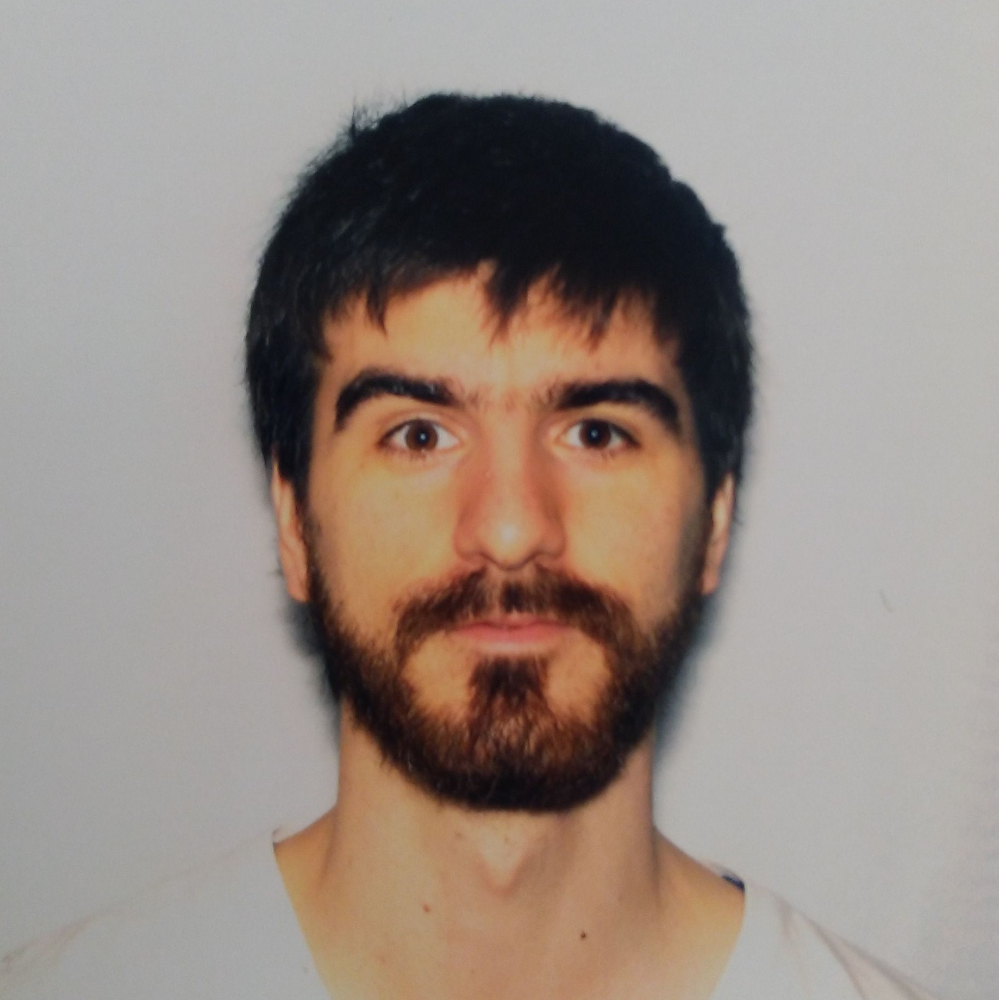
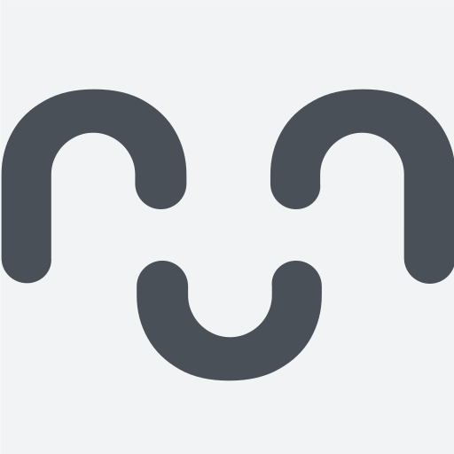
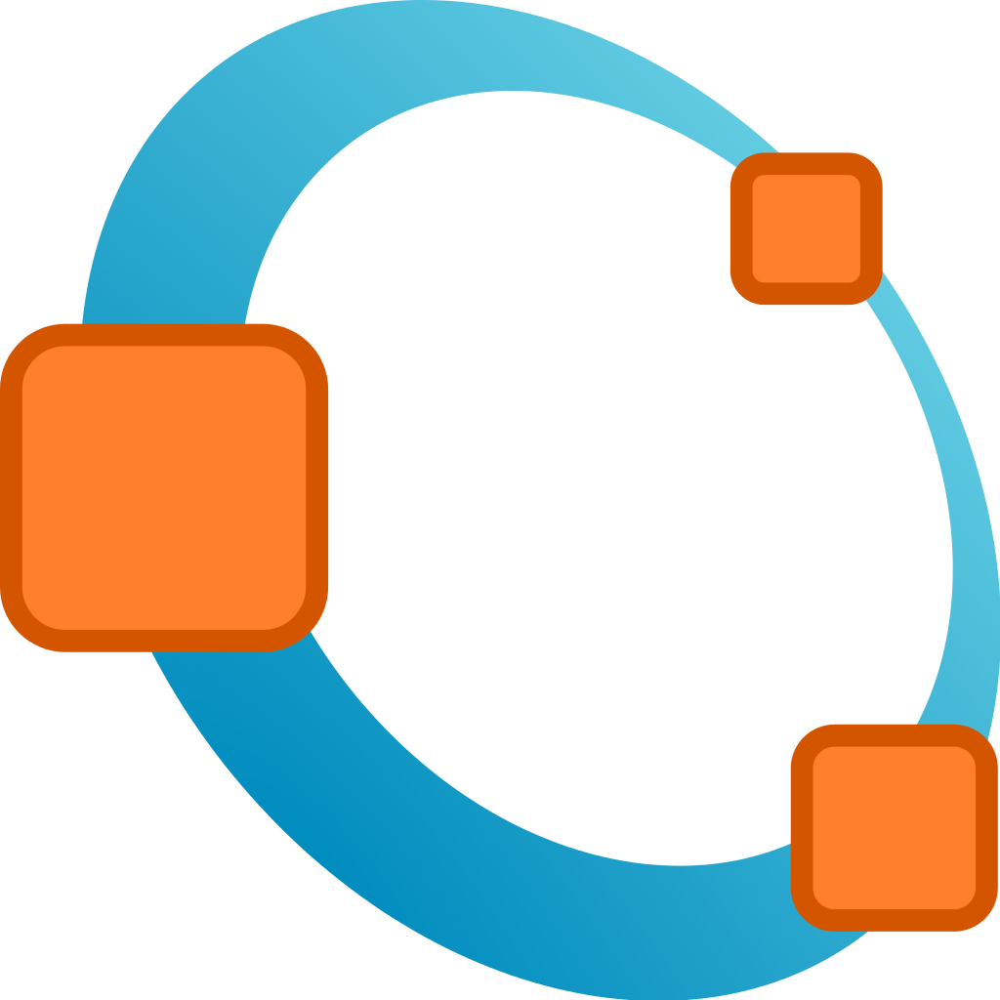
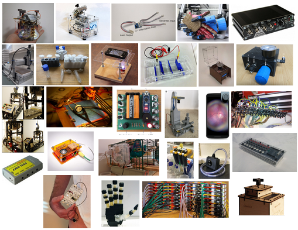
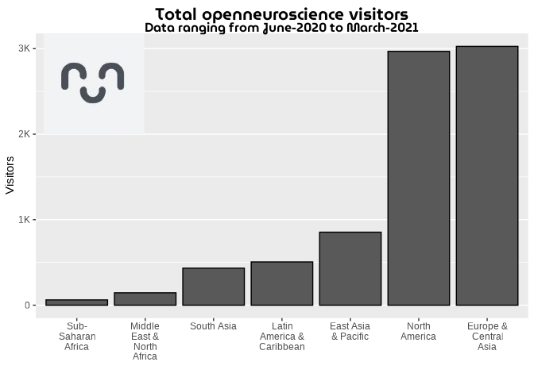
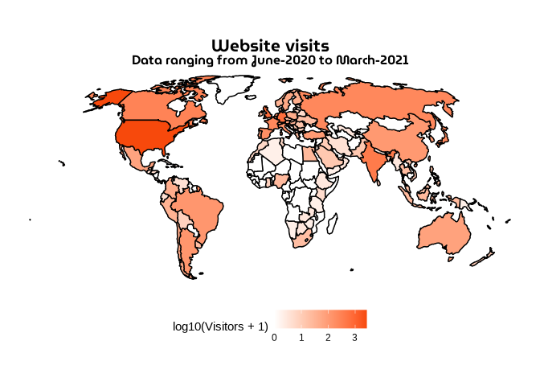
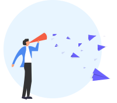
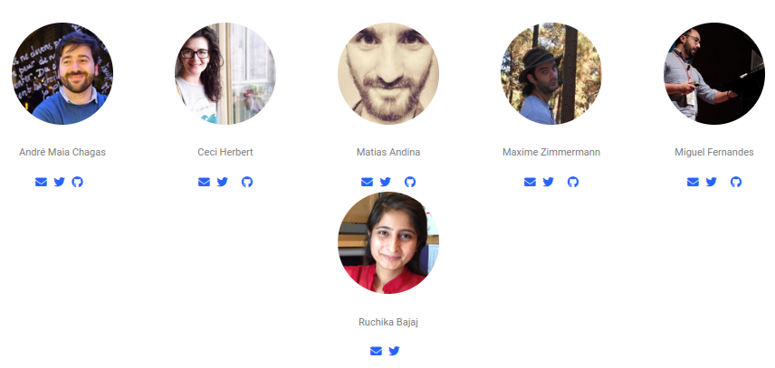

class: center, middle

```{r setup, include=FALSE}
options(htmltools.dir.version = FALSE)
knitr::opts_chunk$set(echo=FALSE, warning = FALSE, message = F,
                      fig.showtext = TRUE)
#library(bslib)
#library(thematic)
# thematic::thematic_rmd()
# bs_theme(bg = "#262626", fg = "#EBE9E9", base_font = font_google("Ubuntu"), 
#    heading_font = font_google("Ubuntu"), bootswatch = "journal")

library(tidyverse, warn.conflicts = F)
library(xaringanthemer)
style_mono_accent( 
  base_color = "#262626", #1c5253 262626
  header_font_google = google_font("Josefin Sans"),
  text_font_google   = google_font("Montserrat", "inherit", "300", "700", "300i"),
  code_font_google   = google_font("Fira Mono"),
  footnote_font_size = "0.7em",
  # this can add colors for use like .red[] 
  colors = c(
  red = "#f34213",
  blue = "#2e68fb",
  purple = "#3e2f5b",
  orange = "#ff8811",
  green = "#136f63",
  white = "#FFFFFF"),
)

library(tidyverse)

```

#  `r emo::ji("wave")` 

--

.pull-left[
**Matias Andina**

Argentinean `r emo::ji("argentina")`,

Biologist `r emo::ji("student")`,
Neuroscientist `r emo::ji("mouse")` `r emo::ji("brain")`
`r icons::icon_find('twitter')` [**@NeuroMLA**](https://twitter.com/neuroMLA)
`r icons::icon_find('github')` [**@matiasandina**](https://github.com/matiasandina)

]

.pull-right[
```{r, out.width="50%"}

```
]


<br>

--


**[Open Neuroscience](http://open-neuroscience.com/)**

```{r, out.width="10%"}

```


---
layout: true

.footnote[`r icons::icon_find('twitter')` [@neuroMLA](https://twitter.com/neuroMLA)]

---
## What is Open Neuroscience?

--

A user-driven database of open neuroscience projects

---
class: middle
## An idea is born

🧑‍🔬 $\rightarrow$ `r emo::ji("thinking")` $\rightarrow$ `r emo::ji("idea")`

--

❗ ... 🔧 ...

--

`r emo::ji("cry")`


---
class: middle
## An idea is born

🧑‍🔬 $\rightarrow$ `r emo::ji("thinking")` $\rightarrow$ `r emo::ji("idea")`

❗ ... 🔧 ...

`r emo::ji("mag_right")`

---
class: middle
## An idea is born

.pull-left[
🧑‍🔬 $\rightarrow$ `r emo::ji("thinking")` $\rightarrow$ `r emo::ji("idea")`

❗ ... 🔧 ...

`r emo::ji("thought_balloon")` "If only there was a database of open projects"

`r emo::ji("mag_right")`
]

.pull-right[
```{r}

```
]

---
class: top
## Why does it matter?


.center[
Scientists want to do science.

Science needs tools.
]
---
class:top
## Why does it matter?

.center[
Scientists want to do science.

Science needs tools.


Tools are often a **major** problem*.
]


.footnote[*: expensive, incompatible, unmodifiable, unavailable, unreliable, irreproducible, old.]

---
class:middle
## There's (almost) always an Open Solution

<center>
.pull-left[
```{r, out.width="50%"}
knitr::include_graphics("img/matlab.png")
```
]

.pull-left[
```{r, out.width="50%"}
knitr::include_graphics("img/python_logo.png")
```
]
</center>

---
class:middle
## There's (almost) always an Open Solution

<center>
.pull-left[
```{r, out.width="50%"}
knitr::include_graphics("img/matlab.png")
```
]

.pull-left[
```{r, out.width="50%"}

```
]
</center>
---
class: top
## What about Hardware?

--

.center[
```{r, out.width="60%"}

```
]

---
## What is Open Neuroscience?

A **.blue[user-driven]** database of open neuroscience projects

<br>

```{r}

```

---
class: top
## What is Open Neuroscience?

Collaborative system:
* Text based pipeline (`.csv` $\rightarrow$ `.md` $\rightarrow$ `.html`)

--

* Everything runs out in the open `r icons::icon_find("github")`

--

* Anyone can create issues and/or pull requests

--

* Everyone is welcome to add their projects*

--

* We use a twitter bot to drive engagement `r icons::icon_find("twitter")` `r emo::ji("robot")`


.footnote[We just check for spam]


---
class: top
## Our metrics

We use **[.blue[plausible]](https://plausible.io/open-neuroscience.com?period=6mo)**. Our metrics are public, we aggregate and show them on **[our site](https://open-neuroscience.com/metrics/)**.

--

.pull-left[
Last 12 months in **[open-neuroscience.com](https://open-neuroscience.com/)**

* ~200 open source projects

* ~10K visitors
]

.pull-right[
```{r}

```
]

---
class: top
## Our metrics

We use **[.blue[plausible]](https://plausible.io/open-neuroscience.com?period=6mo)**. Our matrics are public, we aggregate and show them on **[our site](https://open-neuroscience.com/metrics/)**.

.pull-left[
Last 12 months in **[open-neuroscience.com](https://open-neuroscience.com/)**

* ~200 open source projects

* ~10K visitors

* A global experience
]

.pull-right[
```{r}

```
]

---
## Seminar Series

Open Neuroscience meets [world-wide.org](https://www.world-wide.org/Neuro/Open-Source-Neuro/)

--

`r emo::ji("calendar")` Tool showcase each Friday 

`r icons::feather_icons("youtube")` [Live Broadcast on YouTube](https://www.youtube.com/channel/UCHPvi_HaEU7OQgXQBh9ECvQ)

---
## Our metrics

### [`r icons::icon_style(icons::feather_icons("twitter"), fill="#2e68fb")`](https://www.twitter.com/openneurosci)

~ 2K+ followers

~ 150K+ tweet views

--

### [`r icons::icon_style(icons::feather_icons("youtube"), fill="#F50C3D")`](https://www.youtube.com/channel/UCHPvi_HaEU7OQgXQBh9ECvQ)

~ 100 subscribers

~ 2K+ video reproductions on our seminar series 

---
class: inverse, center, middle
## What's next?

---
class: top
## Growth

```
`r emo::ji("target")` Increase access to open tools in neuroscience.
```

--

Tool adoption depends on fragile chains

Creator's spheres of influence are often independent and disconnected.

--

```{r}
DiagrammeR::grViz("
digraph boxes_and_circles {

  # a 'graph' statement
  graph [
  layout = dot,
  overlap = true, 
  fontsize = 10,
  nodestep = 1.5,
  rankdir = LR]

  # several 'node' statements
  node [shape = box,
        fontname = Helvetica,
        fillcolor = red]
  Creator;  User
  
  node [shape = circle,
        fontname = Helvetica,
        label = '']
  X1; X2; X3; X4; X5

  # several 'edge' statements
  Creator->X1 -> X2 -> X3 -> X4 -> X5 
  X5->User[constraints = false]
}
", height = 300)
```


---
## Growth

```
`r emo::ji("target")` Increase access to open tools in neuroscience.
```

--

Facilitate tool adoption by creating a hub

--


```{r}
DiagrammeR::grViz("
digraph dot {

graph [layout = dot]

node [shape = circle,
      style = filled,
      color = grey,
      label = '']

node [fillcolor = '#2e68fb']
a

node [fillcolor = green, shape = rectangle]
b c d

node [fillcolor = orange]

edge [color = grey]
b -> a
c -> a
d -> a
a -> {e f g h}
a -> {k l m n}
a -> {q r s t}
}", height = 300)
```


---
class: inverse, center, middle
## What can you do?
---
class: middle
## Add a project

<br>
<br>
<br>

.pull-left[
Use this link to add your project

https://bit.ly/2LkTd2a
]

.pull-right[
```{r}
knitr::include_graphics("img/img-addProject-light.svg")
```

]

.footnote[Image by Edwin Cruz]

---
class: middle
## Help solving issues

.pull-left[
Use this link to find and solve issues on our site

`r icons::icon_find("github")`[Open Neuroscience Issues](https://github.com/open-neuroscience/open-neuroscience.github.io/issues)

]

.pull-right[
```{r}
knitr::include_graphics("img/img-contribute-light.svg")
```

]

.footnote[Image by Edwin Cruz]
---
class: middle
## Be Social


.pull-left[
Know someone who's made a great open project? 

Tell them about Open Neuroscience!

Help the movement grow organically by sharing our content

`r icons::icon_find('twitter')` [**@openneurosci**](https://twitter.com/openneurosci)
]

.pull-right[
```{r, out.width="110%"}

```

]

.footnote[Image by Edwin Cruz]
---
## Be awesome

* Adopt open source practices in your research*

--

* Share and help implement open source practices within your team

--

* Sponsor open source projects (`r emo::ji("dollar")` and/or `r emo::ji("time")`)

.footnote[Visit [OSHWA](https://www.oshwa.org/) to learn more!]

---
## Our team

```{r}

```

---
class: center, middle, inverse
## Thank You
