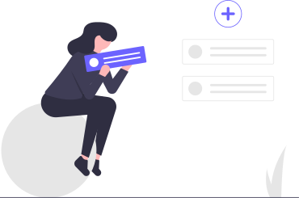
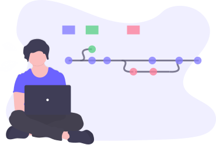

class: center, middle

```{r setup, include=FALSE}
options(htmltools.dir.version = FALSE)
knitr::opts_chunk$set(echo=FALSE, warning = FALSE, message = F,
                      fig.showtext = TRUE)
#library(bslib)
#library(thematic)
# thematic::thematic_rmd()
# bs_theme(bg = "#262626", fg = "#EBE9E9", base_font = font_google("Ubuntu"), 
#    heading_font = font_google("Ubuntu"), bootswatch = "journal")

library(tidyverse, warn.conflicts = F)
library(xaringanthemer)
style_mono_accent( 
  base_color = "#262626", #1c5253 262626
  header_font_google = google_font("Josefin Sans"),
  text_font_google   = google_font("Montserrat", "inherit", "300", "700", "300i"),
  code_font_google   = google_font("Fira Mono"),
  footnote_font_size = "0.7em",
  # this can add colors for use like .red[] 
  colors = c(
  red = "#f34213",
  blue = "#2e68fb",
  purple = "#3e2f5b",
  orange = "#ff8811",
  green = "#136f63",
  white = "#FFFFFF"),
)

library(tidyverse)

```

#  `r emo::ji("wave")` 

--

.pull-left[
**Matias Andina**

Argentinean `r emo::ji("argentina")`,

Biologist `r emo::ji("student")`,
Neuroscientist `r emo::ji("mouse")` `r emo::ji("brain")`
`r icons::icon_find('twitter')` [**@NeuroMLA**](https://twitter.com/neuroMLA)
`r icons::icon_find('github')` [**@matiasandina**](https://github.com/matiasandina)

]

.pull-right[
```{r, out.width="50%"}
knitr::include_graphics("img/mati.jpeg")
```
]


<br>

--


**[Open Neuroscience](http://open-neuroscience.com/)**

```{r, out.width="10%"}
knitr::include_graphics("img/openneuroscience_logo_dark.svg")
```


---
layout: true

.footnote[`r icons::icon_find('twitter')` [@neuroMLA](https://twitter.com/neuroMLA)]

---
## What is Open Neuroscience?

--

A user-driven database of open neuroscience projects

---
class: top
## Why does it matter?


.center[
Scientists want to do science.

Science needs tools.
]
---
class:top
## Why does it matter?

.center[
Scientists want to do science.

Science needs tools.


Tools are often a **major** problem*.
]


.footnote[*: expensive, incompatible, unmodifiable, unavailable, unreliable, irreproducible, old.]

---
class: middle
## An idea is born

🧑‍🔬 $\rightarrow$ `r emo::ji("thinking")` $\rightarrow$ `r emo::ji("idea")`

--

❗ ... 🔧 ...

--

`r emo::ji("cry")`


---
class: middle
## An idea is born

🧑‍🔬 $\rightarrow$ `r emo::ji("thinking")` $\rightarrow$ `r emo::ji("idea")`

❗ ... 🔧 ...

`r emo::ji("mag_right")`

---
class: middle
## An idea is born

.pull-left[
🧑‍🔬 $\rightarrow$ `r emo::ji("thinking")` $\rightarrow$ `r emo::ji("idea")`

❗ ... 🔧 ...

`r emo::ji("thought_balloon")` "If only there was a database of open projects"

`r emo::ji("mag_right")`
]

.pull-right[
```{r}
knitr::include_graphics("img/img-search-light.svg")
```
]
---
class:top
## There's (almost) always an Open Solution

<center>
.pull-left[
```{r, out.width="50%"}
knitr::include_graphics("img/matlab.png")
```
]

.pull-left[
```{r, out.width="50%"}
knitr::include_graphics("img/python_logo.png")
```
]
</center>

---
class:top
## There's (almost) always an Open Solution

<center>
.pull-left[
```{r, out.width="50%"}
knitr::include_graphics("img/matlab.png")
```
]

.pull-left[
```{r, out.width="50%"}
knitr::include_graphics("img/octave.png")
```
]
</center>
---
class: top
## What about Hardware?

--

.center[
```{r, out.width="60%"}
knitr::include_graphics("img/hardware.png")
```
]

---
## What is Open Neuroscience?

A **.blue[user-driven]** database of open neuroscience projects

---
# TODO: ADD HERE HOW WE WORK


---
class: inverse, center, middle
## What can you do?
---
class: middle
## Add a project

<br>
<br>
<br>

.pull-left[
Use this link to add your project

https://bit.ly/2LkTd2a
]

.pull-right[
```{r}

```

]

---
class: middle
## Help solving issues

.pull-left[
Use this link to find and solve issues on our site

`r icons::icon_find("github")`[Open Neuroscience Issues](https://github.com/open-neuroscience/open-neuroscience.github.io/issues)

]

.pull-right[
```{r}

```

]

---
class: middle
## Be Social


.pull-left[
Know someone who's made a great open project? 

Tell them about Open Neuroscience!

Help the movement grow organically by sharing our content

`r icons::icon_find('twitter')` [**@openneurosci**](https://twitter.com/openneurosci)
]

.pull-right[
```{r, out.width="110%"}

```

]

---
## Be awesome

* Adopt open source practices in your research*

--

* Share and help implement open source practices within your team

--

* Sponsor open source projects (`r emo::ji("dollar")` and/or `r emo::ji("time")`)

.footnote[Visit [OSHWA](https://www.oshwa.org/) to learn more!]

---
## Our team

```{r}
knitr::include_graphics("img/team.png")
```

---
class: center, middle, inverse
## Thank You
